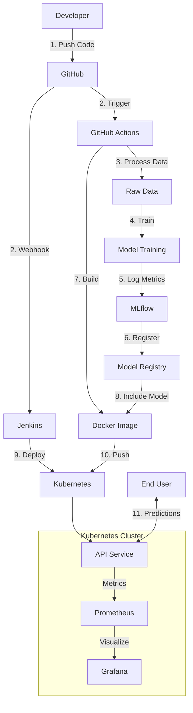
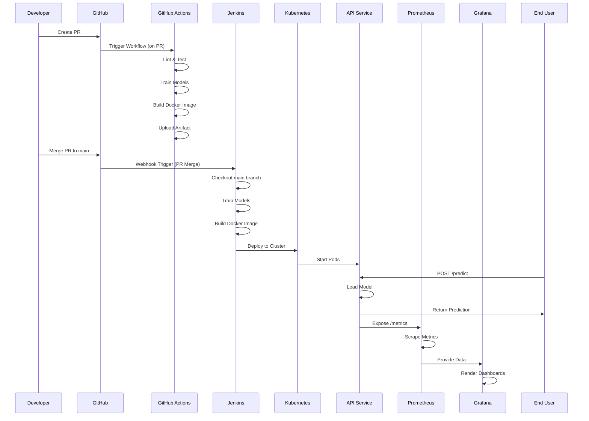
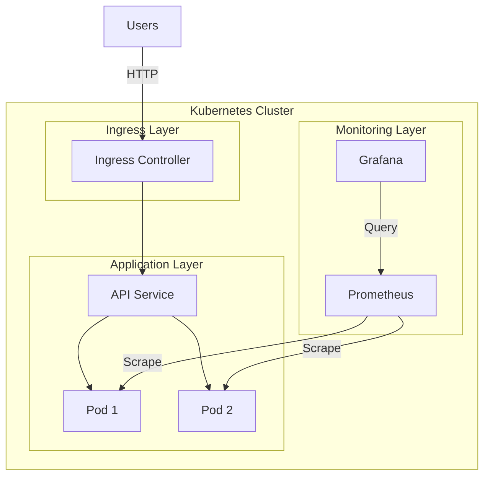
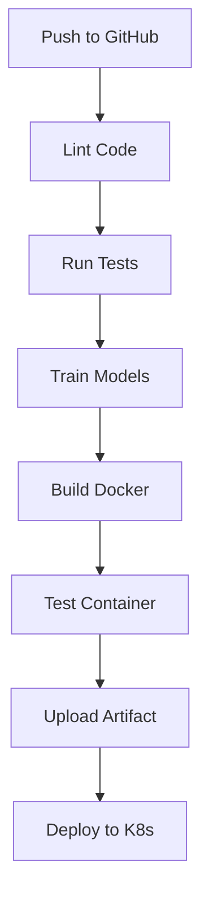
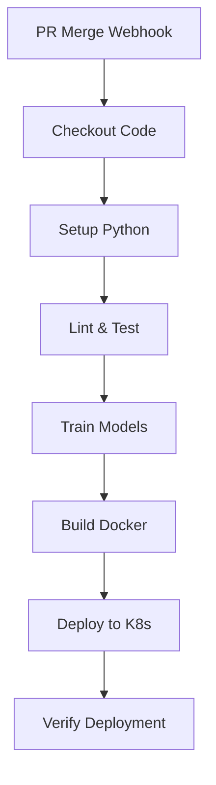
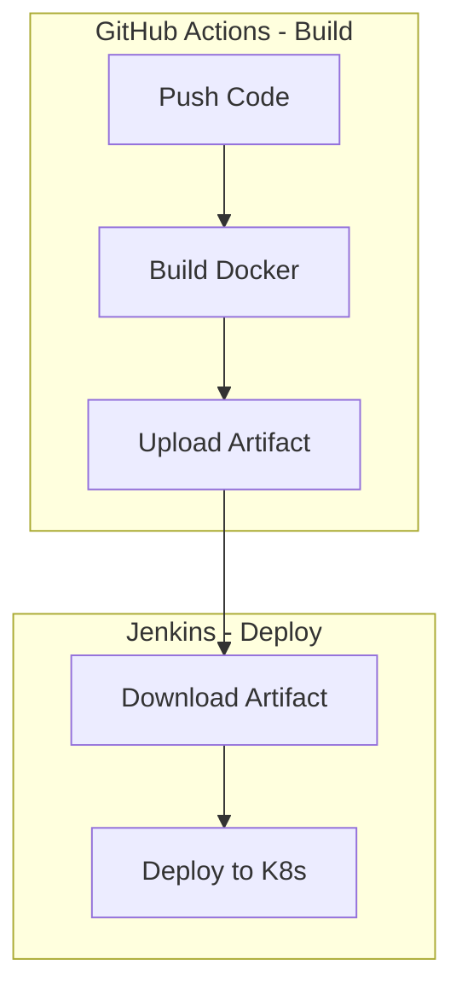
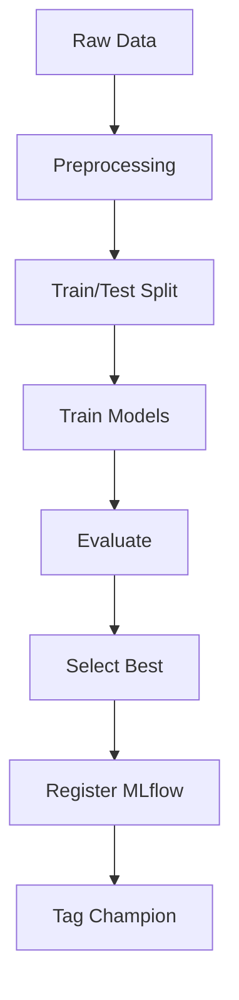
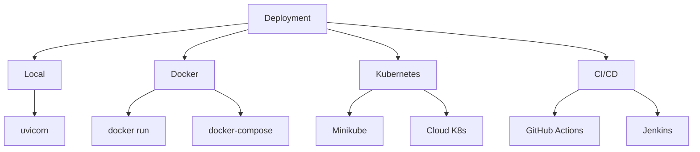
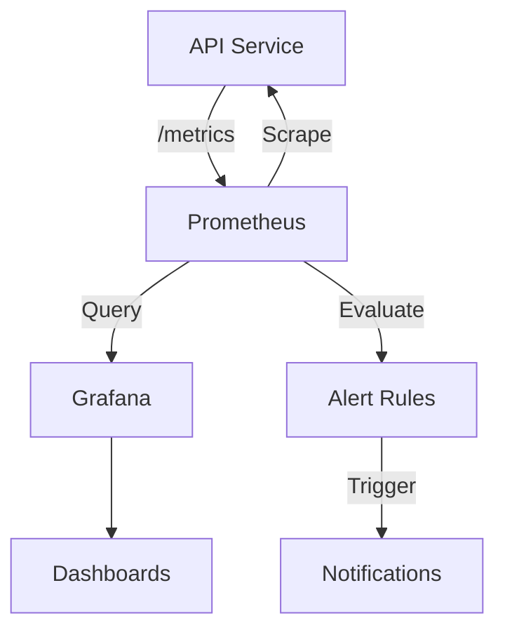

# Heart Disease Prediction - MLOps Project

[](https://github.com/2024aa05820/heart-disease-mlops/actions/workflows/ci.yml)

A production-ready machine learning solution for predicting heart disease risk, built with modern MLOps best practices including CI/CD pipelines, containerization, Kubernetes deployment, and comprehensive monitoring.

---

## 📋 Table of Contents

1. [Project Overview](#-project-overview)
2. [System Architecture](#-system-architecture)
3. [Setup & Installation](#-setup--installation)
4. [CI/CD Pipelines](#-cicd-pipelines)
5. [Model Training & Experiment Tracking](#-model-training--experiment-tracking)
6. [Deployment](#-deployment)
7. [Monitoring & Observability](#-monitoring--observability)
8. [API Documentation](#-api-documentation)
9. [Testing](#-testing)
10. [Project Structure](#-project-structure)

---

## 🎯 Project Overview

### Problem Statement
Predict heart disease risk in patients based on clinical features using machine learning models, deployed as a production-ready API with full MLOps infrastructure.

### Key Features
- **ML Models**: Logistic Regression & Random Forest classifiers
- **Dataset**: UCI Heart Disease Dataset (303 samples, 14 features)
- **Experiment Tracking**: MLflow for model versioning and metrics
- **API**: FastAPI-based REST API with health checks and metrics
- **Containerization**: Docker for consistent deployments
- **Orchestration**: Kubernetes (Minikube) for scalable deployment
- **CI/CD**: GitHub Actions + Jenkins for automated pipelines
- **Monitoring**: Prometheus + Grafana for observability
- **Infrastructure**: Automated setup scripts for Rocky Linux

### Technology Stack

| Component | Technology |
|-----------|-----------|
| **Language** | Python 3.11+ |
| **ML Framework** | scikit-learn |
| **API Framework** | FastAPI |
| **Experiment Tracking** | MLflow |
| **Containerization** | Docker |
| **Orchestration** | Kubernetes (Minikube) |
| **CI/CD** | GitHub Actions, Jenkins |
| **Monitoring** | Prometheus, Grafana |
| **Infrastructure** | Rocky Linux / RHEL / CentOS |

---

## 🏗️ System Architecture

### High-Level Architecture



### Component Interaction Flow



### Deployment Architecture



---

## 🚀 Setup & Installation

### Prerequisites

- **OS**: Rocky Linux 9+ / RHEL 9+ / CentOS 9+ (or any Linux with Docker)
- **Python**: 3.11 or higher
- **Docker**: For containerization
- **Minikube**: For local Kubernetes (optional)
- **kubectl**: Kubernetes CLI (optional)

### Automated Setup (Rocky Linux)

The project includes an automated setup script that installs all prerequisites:

```bash
# Clone repository
git clone https://github.com/2024aa05820/heart-disease-mlops.git
cd heart-disease-mlops

# Run automated setup (installs Java, Docker, kubectl, Minikube, Jenkins, Python)
sudo ./scripts/rocky-setup.sh

# Log out and back in for group changes to take effect
# Or run: newgrp docker
```

**What the setup script installs:**
- Java 17 (for Jenkins)
- Docker & Docker Compose
- kubectl (Kubernetes CLI)
- Minikube (local Kubernetes)
- Jenkins (CI/CD server)
- Python 3.11+ and pip
- Essential development tools

**Setup options:**
```bash
# Skip system update (faster)
sudo ./scripts/rocky-setup.sh --skip-update

# Force system update
sudo ./scripts/rocky-setup.sh --update

# Show help
sudo ./scripts/rocky-setup.sh --help
```

### Manual Setup

#### 1. Python Environment

```bash
# Create virtual environment
python3 -m venv .venv
source .venv/bin/activate

# Or use conda (recommended for ML)
conda create -n heart-mlops python=3.11
conda activate heart-mlops

# Install dependencies
pip install -r requirements.txt
```

#### 2. Download Dataset

```bash
# Using script
python scripts/download_data.py

# Or using Makefile
make download
```

#### 3. Verify Installation

```bash
# Check all services
./scripts/check-all-services.sh

# Or verify individually
./scripts/verify-installation.sh
```

---

## 🔄 CI/CD Pipelines

### GitHub Actions Pipeline

The project uses GitHub Actions for automated CI/CD with the following workflow:



**Workflow File**: `.github/workflows/ci.yml`

**Pipeline Stages:**

1. **Lint** - Code quality checks (ruff, black)
2. **Test** - Unit tests with coverage
3. **Train** - Model training and validation
4. **Docker** - Build and test Docker image
5. **Deploy** - Deploy to Kubernetes (on main branch)

**View Pipeline Status:**
- GitHub Repository → Actions tab
- Badge in README shows current status

**Manual Trigger:**
```bash
# Push to main or create PR
git push origin main
```

### Jenkins Pipeline

Jenkins provides full automation with GitHub webhooks for deployment.

#### Jenkins Standard Pipeline

**Pipeline File**: `Jenkinsfile`



**Setup Jenkins:**

1. **Install Jenkins** (if not done by rocky-setup.sh):
```bash
sudo dnf install java-17-openjdk jenkins -y
sudo systemctl start jenkins
sudo systemctl enable jenkins
sudo cat /var/lib/jenkins/secrets/initialAdminPassword
```

2. **Configure Jenkins:**
```bash
# Add Jenkins user to docker group
sudo usermod -aG docker jenkins
sudo systemctl restart jenkins

# Configure Jenkins to access Minikube
./scripts/configure-jenkins-minikube.sh
```

3. **Create Pipeline Job:**
   - Jenkins Dashboard → New Item → Pipeline
   - **Name**: `heart-disease-mlops`
   - **Pipeline** → Definition: Pipeline script from SCM
   - **SCM**: Git
   - **Repository URL**: `https://github.com/2024aa05820/heart-disease-mlops.git`
   - **Branch Specifier**: `*/main` (only build main branch)
   - **Script Path**: `Jenkinsfile`
   - **Build Triggers**: ✅ GitHub hook trigger for GITScm polling

4. **Configure GitHub Webhook (for PR Merge):**
   - GitHub Repository → Settings → Webhooks → Add webhook
   - **Payload URL**: `http://your-server-ip:8080/github-webhook/`
   - **Content type**: `application/json`
   - **Events**: 
     - ✅ "Pull requests" (triggers on PR events)
     - ✅ "Pushes" (triggers on direct pushes to main)
   - **Active**: ✅ Enabled
   - **Note**: Pipeline automatically triggers when PR is merged to main branch

#### Jenkins Hybrid Pipeline

**Pipeline File**: `Jenkinsfile.hybrid`

Combines GitHub Actions (build) with Jenkins (deploy) for best of both worlds:



**Benefits:**
- ✅ Fast cloud builds (GitHub runners)
- ✅ Controlled deployment (your server)
- ✅ Free CI/CD minutes
- ✅ Production-like pattern

**Setup Hybrid Pipeline:**

1. **Create GitHub Token:**
   - GitHub Settings → Developer settings → Personal access tokens
   - Generate token with `repo` and `actions:read` permissions

2. **Add Token to Jenkins:**
   - Jenkins → Manage Jenkins → Credentials
   - Add Secret text with ID: `github-token`

3. **Create Pipeline:**
   - New Item → Pipeline
   - Script Path: `Jenkinsfile.hybrid`
   - Enable GitHub webhook

4. **Deploy:**
   - Push code → GitHub Actions builds → Jenkins auto-deploys

**Access Jenkins:**
```bash
# Get initial password
sudo cat /var/lib/jenkins/secrets/initialAdminPassword

# Access UI
http://your-server-ip:8080
```

---

## 🤖 Model Training & Experiment Tracking

### Training Pipeline



### Training Models

```bash
# Activate environment
source .venv/bin/activate  # or: conda activate heart-mlops

# Train models (automated workflow)
./scripts/train-and-register.sh

# Or manual training
python scripts/train.py

# Or using Makefile
make train
```

**What happens during training:**
1. Downloads dataset (if not present)
2. Preprocesses data (scaling, encoding)
3. Trains Logistic Regression and Random Forest
4. Evaluates models (accuracy, precision, recall, F1, ROC-AUC)
5. Logs metrics to MLflow
6. Registers best model in MLflow Model Registry
7. Tags best model as "champion"

### MLflow Experiment Tracking

**Start MLflow UI:**

```bash
# Start MLflow server
mlflow ui --backend-store-uri mlruns --host 0.0.0.0 --port 5000

# Or using script
./scripts/start_mlflow_ui.sh

# Or using Makefile
make mlflow-ui
```

**Access MLflow:**
- Local: `http://localhost:5000`
- Remote: `http://your-server-ip:5000`
- SSH Tunnel: `ssh -L 5000:localhost:5000 user@server`

**MLflow Features:**
- **Experiments**: Organize runs by experiment
- **Runs**: Track individual training runs
- **Metrics**: Accuracy, Precision, Recall, F1, ROC-AUC
- **Parameters**: Model hyperparameters
- **Artifacts**: ROC curves, confusion matrices, feature importance
- **Model Registry**: Version control for models

**View Experiments:**
```bash
# Check MLflow status
python scripts/check_mlflow_status.py

# List experiments
mlflow experiments list
```

---

## 🚢 Deployment

### Deployment Options



### 1. Local Development

```bash
# Start API locally
make serve
# Or
uvicorn src.api.app:app --host 0.0.0.0 --port 8000 --reload

# Test API
curl http://localhost:8000/health
```

### 2. Docker Deployment

```bash
# Build image
make docker-build
# Or
docker build -t heart-disease-api:latest .

# Run container
make docker-run
# Or
docker run -d -p 8000:8000 --name heart-api heart-disease-api:latest

# Check logs
docker logs -f heart-api

# Stop container
docker stop heart-api
docker rm heart-api
```

### 3. Kubernetes Deployment

#### Start Minikube

```bash
# Start Minikube
minikube start --driver=docker --cpus=2 --memory=4096

# Or low memory mode
./scripts/start-minikube-low-memory.sh

# Check status
minikube status
kubectl cluster-info
```

#### Deploy Application

```bash
# Deploy all components
kubectl apply -f deploy/k8s/

# Or using Makefile
make deploy

# Check deployment status
kubectl get pods
kubectl get services
kubectl get deployments

# View logs
kubectl logs -l app=heart-disease-api -f
```

#### Access Services

```bash
# Port-forward API
kubectl port-forward service/heart-disease-api-service 8000:80

# Port-forward Prometheus
kubectl port-forward service/prometheus 9090:9090

# Port-forward Grafana
kubectl port-forward service/grafana 3000:3000

# Access in browser
# API: http://localhost:8000/docs
# Prometheus: http://localhost:9090
# Grafana: http://localhost:3000 (admin/admin)
```

#### Kubernetes Resources

| Resource | File | Purpose |
|----------|------|---------|
| **Deployment** | `deploy/k8s/deployment.yaml` | API application pods |
| **Service** | `deploy/k8s/service.yaml` | Service discovery & load balancing |
| **Ingress** | `deploy/k8s/ingress.yaml` | External access routing |
| **Monitoring** | `deploy/k8s/monitoring.yaml` | Prometheus & Grafana |
| **Alerts** | `deploy/k8s/prometheus-alerts.yaml` | Alert rules |

### 4. Automated Deployment Scripts

```bash
# Complete workflow (train + deploy)
./scripts/complete-ml-workflow.sh

# Remote quick deploy
./scripts/remote_quick_deploy.sh

# Deploy to Minikube
./scripts/deploy_to_minikube.sh

# Deploy GitHub artifact
./scripts/deploy_github_artifact.sh docker-image.tar.gz
```

---

## 📊 Monitoring & Observability

### Monitoring Stack



### Prometheus

**Purpose**: Metrics collection and storage

**Configuration**: `deploy/k8s/monitoring.yaml`

**Features:**
- Service discovery (Kubernetes pods & services)
- Time-series database
- PromQL query language
- Alert rule evaluation

**Access:**
```bash
# Port-forward
kubectl port-forward service/prometheus 9090:9090

# Access UI
http://localhost:9090
```

**Key Metrics:**
- `predictions_total` - Total predictions counter
- `prediction_latency_seconds` - Prediction latency histogram
- `request_count_total` - Request counter by method/endpoint/status
- `up{service="heart-disease-api"}` - Service health status

**Query Examples:**
```promql
# Total predictions
sum(predictions_total)

# Prediction rate
sum(rate(predictions_total[5m]))

# P95 latency
histogram_quantile(0.95, sum(rate(prediction_latency_seconds_bucket[5m])) by (le))

# Error rate
sum(rate(request_count_total{status=~"5.."}[5m])) / sum(rate(request_count_total[5m])) * 100
```

### Grafana

**Purpose**: Metrics visualization and dashboards

**Configuration**: `grafana/comprehensive-dashboard.json`

**Access:**
```bash
# Port-forward
kubectl port-forward service/grafana 3000:3000

# Access UI
http://localhost:3000
# Default credentials: admin/admin
```

**Dashboards:**
1. **Comprehensive Monitoring Dashboard**
   - Total Predictions
   - Predictions/sec
   - P95 Prediction Latency
   - Error Rate %
   - Prediction Rate Over Time
   - Predictions Distribution (Pie Chart)
   - Prediction Latency Percentiles
   - Request Rate by Status Code
   - Request Rate by Endpoint
   - API Health Status
   - Request Rate by HTTP Method
   - Heart Disease Detection Rate

2. **Basic API Dashboard**
   - Core metrics overview

**Import Dashboards:**
```bash
# Setup Grafana dashboards
./scripts/setup-grafana-dashboards.sh

# Or manually in Grafana UI:
# Configuration → Data Sources → Add Prometheus
# Dashboards → Import → Upload JSON file
```

**Configure Data Source:**
```bash
# Fix Grafana datasource
./scripts/fix-grafana-datasource.sh
```

### Alert Rules

**Configuration**: `deploy/k8s/prometheus-alerts.yaml`

**Alerts:**
- High Error Rate (Warning: >5%, Critical: >10%)
- High Prediction Latency (Warning: P95 >1s, Critical: P95 >2s)
- API Service Down

**View Alerts:**
```bash
# Port-forward Prometheus
kubectl port-forward service/prometheus 9090:9090

# Visit: http://localhost:9090/alerts
```

### Generate Test Traffic

```bash
# Generate prediction traffic (500 requests, 10% errors)
./scripts/generate-prediction-traffic.sh

# Custom configuration
MAX_REQUESTS=1000 ERROR_RATE=20 ./scripts/generate-prediction-traffic.sh

# Simple version
./scripts/generate-traffic-simple.sh http://localhost:8000 500 1
```

**See**: `scripts/README-TRAFFIC-GENERATION.md` for detailed usage.

---

## 📡 API Documentation

### Base URL
- **Local**: `http://localhost:8000`
- **Kubernetes**: `http://heart-disease-api-service:80` (cluster-internal)
- **Port-forward**: `http://localhost:8000` (after port-forward)

### Endpoints

| Endpoint | Method | Description | Request Body |
|----------|--------|-------------|--------------|
| `/` | GET | API information | - |
| `/health` | GET | Health check | - |
| `/predict` | POST | Make prediction | Patient features (JSON) |
| `/metrics` | GET | Prometheus metrics | - |
| `/schema` | GET | Feature schema | - |
| `/docs` | GET | Swagger UI | - |
| `/redoc` | GET | ReDoc documentation | - |

### Health Check

```bash
curl http://localhost:8000/health
```

**Response:**
```json
{
  "status": "healthy",
  "model_loaded": true,
  "timestamp": "2024-01-15T10:30:00"
}
```

### Make Prediction

```bash
curl -X POST http://localhost:8000/predict \
  -H "Content-Type: application/json" \
  -d '{
    "age": 63,
    "sex": 1,
    "cp": 3,
    "trestbps": 145,
    "chol": 233,
    "fbs": 1,
    "restecg": 0,
    "thalach": 150,
    "exang": 0,
    "oldpeak": 2.3,
    "slope": 0,
    "ca": 0,
    "thal": 1
  }'
```

**Response:**
```json
{
  "prediction": 1,
  "prediction_label": "Heart Disease",
  "probability_no_disease": 0.23,
  "probability_disease": 0.77,
  "confidence": 0.77,
  "timestamp": "2024-01-15T10:30:00"
}
```

### Feature Schema

| Feature | Type | Range | Description |
|---------|------|-------|-------------|
| `age` | int | 0-120 | Age in years |
| `sex` | int | 0-1 | Sex (1=male, 0=female) |
| `cp` | int | 0-3 | Chest pain type |
| `trestbps` | int | 50-250 | Resting blood pressure (mm Hg) |
| `chol` | int | 100-600 | Serum cholesterol (mg/dl) |
| `fbs` | int | 0-1 | Fasting blood sugar > 120 mg/dl |
| `restecg` | int | 0-2 | Resting ECG results |
| `thalach` | int | 50-250 | Maximum heart rate achieved |
| `exang` | int | 0-1 | Exercise induced angina |
| `oldpeak` | float | 0-10 | ST depression induced by exercise |
| `slope` | int | 0-2 | Slope of peak exercise ST segment |
| `ca` | int | 0-4 | Number of major vessels colored by fluoroscopy |
| `thal` | int | 0-3 | Thalassemia |

### Prometheus Metrics

```bash
curl http://localhost:8000/metrics
```

**Key Metrics:**
- `predictions_total{result="disease"}` - Total disease predictions
- `predictions_total{result="no_disease"}` - Total no-disease predictions
- `prediction_latency_seconds_bucket` - Latency histogram buckets
- `request_count_total{method, endpoint, status}` - Request counter

---

## 🧪 Testing

### Run Tests

```bash
# Run all tests
make test
# Or
pytest tests/ -v

# Run with coverage
pytest tests/ -v --cov=src --cov-report=html

# Run specific test file
pytest tests/test_api.py -v
pytest tests/test_model.py -v
pytest tests/test_data.py -v
```

### Test API

```bash
# Health check
curl http://localhost:8000/health

# Check API status
./scripts/check-api-status.sh

# Generate test traffic
./scripts/generate-prediction-traffic.sh
```

### Linting & Formatting

```bash
# Run linter
make lint
# Or
ruff check src/ tests/ scripts/

# Format code
make format
# Or
black src/ tests/ scripts/

# Check formatting
black --check src/ tests/ scripts/
```

---

## 📁 Project Structure

```
heart-disease-mlops/
├── .github/
│   └── workflows/
│       └── ci.yml                 # GitHub Actions CI/CD pipeline
├── data/
│   ├── raw/                        # Raw dataset
│   └── processed/                  # Processed data
├── deploy/
│   └── k8s/                        # Kubernetes manifests
│       ├── deployment.yaml        # API deployment
│       ├── service.yaml            # Service definitions
│       ├── ingress.yaml            # Ingress configuration
│       ├── monitoring.yaml         # Prometheus & Grafana
│       └── prometheus-alerts.yaml  # Alert rules
├── grafana/
│   ├── comprehensive-dashboard.json # Main dashboard
│   ├── heart-disease-api-dashboard.json
│   └── README.md
├── models/                         # Saved model artifacts
├── mlruns/                         # MLflow tracking data
├── notebooks/
│   └── 01_eda.ipynb                # Exploratory data analysis
├── scripts/                        # Utility scripts
│   ├── rocky-setup.sh              # Automated setup script
│   ├── train-and-register.sh       # Training workflow
│   ├── complete-ml-workflow.sh     # End-to-end workflow
│   ├── generate-prediction-traffic.sh # Traffic generator
│   ├── check-api-status.sh         # API status checker
│   └── ...                         # Other utility scripts
├── src/
│   ├── api/
│   │   └── app.py                  # FastAPI application
│   ├── config/
│   │   └── config.yaml             # Configuration file
│   ├── data/
│   │   └── pipeline.py             # Data preprocessing
│   └── models/
│       ├── train.py                # Model training
│       └── predict.py              # Model prediction
├── tests/                          # Unit tests
│   ├── test_api.py
│   ├── test_data.py
│   └── test_model.py
├── Dockerfile                      # Docker image definition
├── Jenkinsfile                     # Jenkins pipeline
├── Jenkinsfile.hybrid              # Hybrid Jenkins pipeline
├── Makefile                        # Make commands
├── requirements.txt                # Python dependencies
└── README.md                       # This file
```

---

## 🛠️ Quick Reference

### Makefile Commands

```bash
# Setup
make init              # Create venv and install dependencies
make init-conda        # Create conda environment
make install           # Install dependencies

# Data & Training
make download          # Download dataset
make train             # Train models

# Development
make serve             # Start API locally
make test              # Run tests
make lint              # Run linter
make format            # Format code

# Docker
make docker-build      # Build Docker image
make docker-run        # Run Docker container

# Kubernetes
make deploy            # Deploy to Kubernetes
make k8s-status        # Check deployment status
make k8s-logs          # View pod logs

# MLflow
make mlflow-ui         # Start MLflow UI

# Rocky Linux
make rocky-setup       # Install all prerequisites
make rocky-start       # Start Minikube
```

### Common Scripts

```bash
# Setup & Installation
./scripts/rocky-setup.sh                    # Automated setup
./scripts/verify-installation.sh            # Verify installation

# Training & MLflow
./scripts/train-and-register.sh             # Train models
./scripts/complete-ml-workflow.sh           # Full workflow
./scripts/start_mlflow_ui.sh                # Start MLflow

# Deployment
./scripts/remote_quick_deploy.sh            # Quick deploy
./scripts/deploy_to_minikube.sh             # Deploy to Minikube
./scripts/deploy_github_artifact.sh        # Deploy artifact

# Monitoring
./scripts/setup-monitoring.sh               # Setup monitoring
./scripts/setup-grafana-dashboards.sh      # Setup Grafana
./scripts/fix-prometheus-targets.sh         # Fix Prometheus

# Testing
./scripts/generate-prediction-traffic.sh   # Generate traffic
./scripts/check-api-status.sh              # Check API status
```

---

## 📚 Additional Resources

### Documentation
- **MLflow**: https://mlflow.org/docs/latest/
- **FastAPI**: https://fastapi.tiangolo.com/
- **Prometheus**: https://prometheus.io/docs/
- **Grafana**: https://grafana.com/docs/
- **Kubernetes**: https://kubernetes.io/docs/

### Troubleshooting

```bash
# Check all services
./scripts/check-all-services.sh

# Diagnose monitoring issues
./scripts/diagnose-monitoring.sh

# Troubleshoot Grafana
./scripts/troubleshoot-grafana-metrics.sh

# Fix Prometheus scraping
./scripts/fix-prometheus-targets.sh

# Check API status
./scripts/check-api-status.sh
```

---

## 📄 License

This project is for educational purposes (BITS Pilani MLOps Assignment).

## 👤 Author

- **Course**: MLOps (S1-25_AIMLCZG523)
- **Institution**: BITS Pilani
- **Repository**: https://github.com/2024aa05820/heart-disease-mlops

---

## 🎓 Assignment Deliverables Summary

### ✅ Completed Deliverables

1. **Data Pipeline** - Automated data preprocessing and feature engineering
2. **Model Training** - Multiple models with hyperparameter tuning
3. **Experiment Tracking** - MLflow integration with model registry
4. **API Development** - FastAPI REST API with health checks
5. **Containerization** - Docker image with multi-stage builds
6. **Orchestration** - Kubernetes deployment with HPA
7. **CI/CD Pipeline** - GitHub Actions + Jenkins automation
8. **Monitoring** - Prometheus metrics + Grafana dashboards
9. **Infrastructure** - Automated setup scripts for Rocky Linux
10. **Documentation** - Comprehensive README with diagrams

---

**🚀 Ready to deploy? Start with the [Setup & Installation](#-setup--installation) section!**
